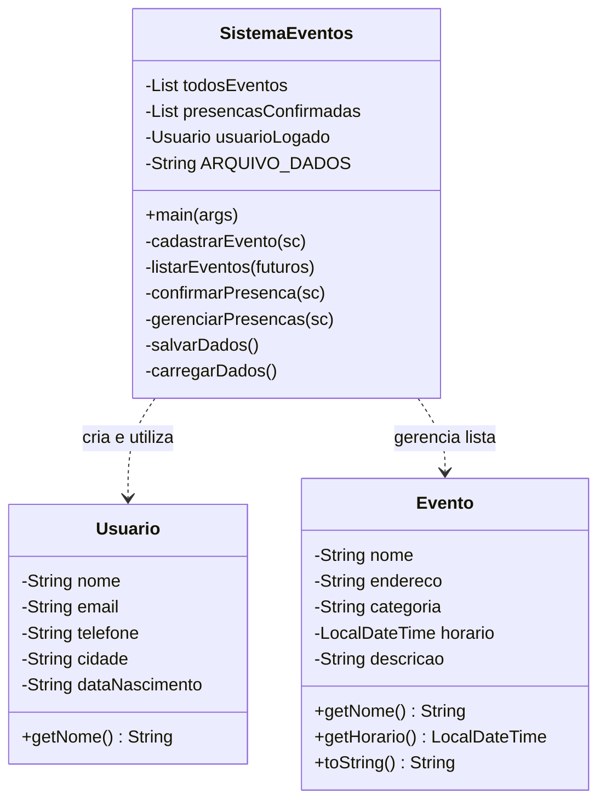

```mermaid
classDiagram
    class Usuario {
        -String nome
        -String email
        -String telefone
        -String cidade
        -String dataNascimento
        +getNome() String
    }
    class Evento {
        -String nome
        -String endereco
        -String categoria
        -LocalDateTime horario
        -String descricao
        +getNome() String
        +getHorario() LocalDateTime
        +toString() String
    }
    class SistemaEventos {
        -List todosEventos
        -List presencasConfirmadas
        -Usuario usuarioLogado
        -String ARQUIVO_DADOS
        +main(args)
        -cadastrarEvento(sc)
        -listarEventos(futuros)
        -confirmarPresenca(sc)
        -gerenciarPresencas(sc)
        -salvarDados()
        -carregarDados()
    }
    SistemaEventos ..> Usuario : cria e utiliza
    SistemaEventos ..> Evento : gerencia lista
```

